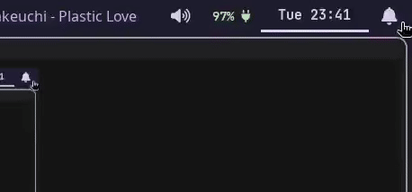

# swaync-widgets
This tool allows you to dynamically update the `buttons-grid` in your [swaync](https://github.com/ErikReider/SwayNotificationCenter) `config.json` and `styles.css`.



**Disclaimer:** I've made this tool for **me**. It's working as I intended by now. I may add features or do bugfixes, but it's always better to clone the repo if you need stuff to be done now. The source code is very compact, so adding new features should not be complicated.

## How it works
This is a snippet from my config file at `~/.config/swaync/config.json`
```json
{
    "widget-config": {
        "buttons-grid": {
            "actions": [
                {
                    "label": "   Connected",
                    "command": "swaync-widgets wifi"
                },
                {
                    "label": "󰕾  Mute",
                    "command": "swaync-widgets mute"
                }
                // more stuff
            ]
    }
}
```

For each widget in your `swaync-widgets` config file, you can define commands to:
- Define custom CSS based on states (on/off)
- Check the status (state) of a widget
- Enable a widget
- Disable a widget

For example, consider the default configuration for a `mute` widget
```toml
[[widget]]
desc="mute"
index="2"
off_label="󰕾  Mute"
on_label="󰕾  Muted"
turn_on_command="pactl set-sink-mute @DEFAULT_SINK@ on"
turn_off_command="pactl set-sink-mute @DEFAULT_SINK@ off"
check_status_command="pactl get-sink-mute @DEFAULT_SINK@ | grep \"yes\""
```

Let's do a quick tour for each option:
- desc: identifier to use e.g: `swaync-widgets mute`
- index: used on css selector like `div:nth-child(X)`. 1 is the first index
- off_label: the label when the state is off
- on_label: the label when the state is on
- turn_on_command: the command that will run when the state is off and you call `swaync-widgets widget`
- turn_off_command: the command that will run when the state is on and you call `swaync-widgets widget`
- check_status_command: if output is empty or return code is not `0`, the state is considered off

## CSS selectors
Currently, it supports 4 selectors:
- The widget button
- The widget button when hovered
- The widget label
- The widget label when hovered

For each selector, you define CSS properties for states `on` and `off`.
- It will apply the properties based on the widget state.
- You can't define custom CSS per widget, only per state

## Using the tool
When you call `swaync-widgets` without any args, it updates:
- The swaync `config.json` file by using the index, state of widget and labels on config file:
    - If the widget is **active**, it will try to replace the `on_label` with `off_label`
    - If it is **not active**, it will do the opposite.
- A new css file at `~/.config/swaync/widgets.css`. This file is generated by `swaync-widgets`. You just need to import it to your `styles.css` file.

### Toggle widgets
The command in the snippet is `"command": "swaync-widgets wifi"`. Internally, it checks the current state by using the `check_status_command` for the widget and runs the appropriate command in response. Then it reloads both `config.json` and `styles.css` config files.

> A full explanation of each entry is in the swaync-widgets default config.

## Setup
- Clone the repo and run the install script
- By default, it installs in `~/.local/bin`, so no root access is needed
- I encourage you to read the install script before running it

### ~/.config/swaync/config.json
- Your current labels for each widget in `~/.config/swaync/config.json` **will be overwritten**. Be carefull.

### ~/.config/swaync/style.css
- You need to manually include the following import in your current config: `@import url("widgets.css");`
- `swaync-widget` doesn't touch your CSS config file.
- If, like me, you use colors, you can add them in the `prepend_css` field in your config: `css_prepend="@define-color pink rgb(245, 194, 231);"`
- Everything there will be placed before any CSS rules

 ### ~/.config/swaync/widgets.css
This is an example of a generated `widgets.css` file. Its content is made entirely from the content of `~/.config/swaync-widgets/config.toml`.
> This file is always changing. Don't source control it.

> You will never need to touch this file, but if something is broken, investigating it may help with debugging.

```css
@define-color pink rgb(245, 194, 231); @define-color crust rgb(17, 17, 27); @define-color surface0 #313244; @define-color text rgb(205, 214, 244);
/* widget vpn */
.widget-buttons-grid>flowbox>flowboxchild:nth-child(4)>button{background: @transparent; border: 2px solid @surface0}
.widget-buttons-grid>flowbox>flowboxchild:nth-child(4)>button:hover{background: @transparent; border: 2px solid @pink}
.widget-buttons-grid>flowbox>flowboxchild:nth-child(4)>button>label{color: @text;}
.widget-buttons-grid>flowbox>flowboxchild:nth-child(4)>button:hover>label{color: @pink;}
/* widget mute */
.widget-buttons-grid>flowbox>flowboxchild:nth-child(2)>button{background: @transparent; border: 2px solid @surface0}
.widget-buttons-grid>flowbox>flowboxchild:nth-child(2)>button:hover{background: @transparent; border: 2px solid @pink}
.widget-buttons-grid>flowbox>flowboxchild:nth-child(2)>button>label{color: @text;}
.widget-buttons-grid>flowbox>flowboxchild:nth-child(2)>button:hover>label{color: @pink;}
/* widget wifi */
.widget-buttons-grid>flowbox>flowboxchild:nth-child(1)>button{background: @pink; border: 2px solid @pink}
.widget-buttons-grid>flowbox>flowboxchild:nth-child(1)>button:hover{background: @pink; border: 2px solid @pink}
.widget-buttons-grid>flowbox>flowboxchild:nth-child(1)>button>label{color: @crust;}
.widget-buttons-grid>flowbox>flowboxchild:nth-child(1)>button:hover>label{color: @crust;}
/* widget bluetooth */
.widget-buttons-grid>flowbox>flowboxchild:nth-child(3)>button{background: @transparent; border: 2px solid @surface0}
.widget-buttons-grid>flowbox>flowboxchild:nth-child(3)>button:hover{background: @transparent; border: 2px solid @pink}
.widget-buttons-grid>flowbox>flowboxchild:nth-child(3)>button>label{color: @text;}
.widget-buttons-grid>flowbox>flowboxchild:nth-child(3)>button:hover>label{color: @pink;}
```

## Troubleshooting
### `swaync-widgets` only works when `swaync` is started manually
This could be a `PATH` problem. If you start `swaync` with Hyprland using `exec-once=swaync`, `swaync` will not have access to the `PATH` declared in your `~/.bashrc` or `~/.zshrc`. You can check the output of `swaync` by using a helper script when starting it and piping the output somewhere.

```bash
#!/usr/bin/env bash
swaync > "/home/$USER/swaync-out.txt" 2>&1
```

Then check for any errors. In my case, the error was `Run_Script Error: Failed to execute child process “swaync-widgets” (No such file or directory)`.

**Solution:** Add a wrapper script with the `PATH` that contains the `swaync-widgets` binary.  
Example: `~/.config/hypr/scripts/run-swaync.sh`

```bash
#!/usr/bin/env bash
PATH=$PATH:/home/$USER/.local/bin
swaync
```

Then start it like this: `exec-once = $scriptsDir/run-swaync.sh`
